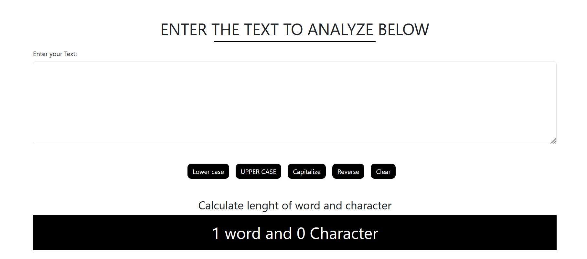

# Text Converter App

### Overview

The Text Converter App is a simple React application that allows users to manipulate text input in various ways. Users can convert text to lowercase, uppercase, capitalize each word, reverse the text, or clear the input entirely. Additionally, the app provides a word and character count for the input text.

### Features

- Lowercase Conversion: Converts all text to lowercase.
- Uppercase Conversion: Converts all text to uppercase.
- Capitalize: Capitalizes the first letter of each word.
- Reverse: Reverses the entire text.
- Clear: Clears the text input field.
- Word and Character Count: Displays the number of words and characters in the input text.